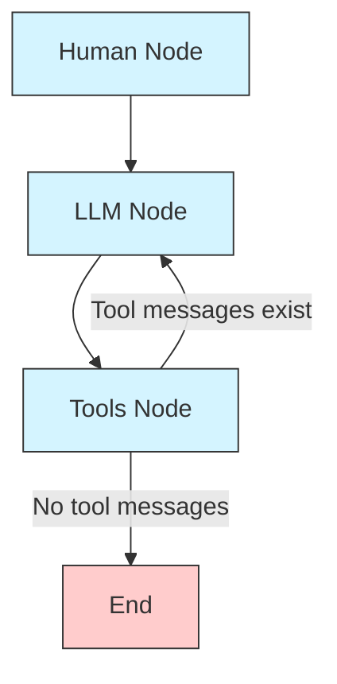
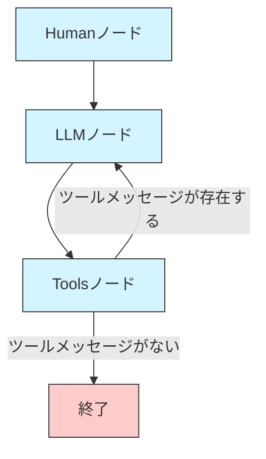

# Custom Tools, Custom Powers: GitHub Repository Security Audit Tool (AAIDC-Week5-Lesson-4b)

This project is part of the AAIDC course assignment: [Custom Tools, Custom Powers: Extending Your Agent's Capabilities](https://app.readytensor.ai/publications/custom-tools-custom-powers-extending-your-agents-capabilities-pcFgUEFJjkzC)

## Overview

This project demonstrates how to build AI agents with custom tools that can interact with external systems. Using LangGraph and LangChain, we implement a security audit tool that can scan GitHub repositories for sensitive information that might have been accidentally committed, such as API keys in `.env` files.

The project showcases how to create custom tools that extend an AI agent's capabilities beyond conversation, allowing it to perform real-world tasks like downloading repositories, searching for specific files, and analyzing their contents for security risks.

## Key Features

- **GitHub Repository Analysis**: Download and extract GitHub repositories for security auditing
- **Sensitive Information Detection**: Scan for `.env` files and analyze them for API keys, passwords, and other sensitive data
- **Custom Tool Integration**: Seamlessly integrate specialized tools with LLM-based agents
- **Interactive Interface**: Chat-based interface for requesting and receiving security audits
- **Detailed Security Reports**: Generate comprehensive reports with risk levels and recommendations

## Technical Concepts

Through this project, you can learn the following concepts:

1. **Custom Tool Creation**: Building specialized tools with the `@tool` decorator
2. **LangGraph Workflow**: Creating stateful, graph-based workflows for complex agent behavior
3. **State Management**: Tracking conversation and tool execution state
4. **Conditional Routing**: Directing the flow based on agent decisions and tool results
5. **Error Handling**: Implementing robust error handling for external operations

## Installation

### Prerequisites

- Python 3.8 or higher
- OpenAI API key
- Git (for cloning the repository)

### Setup

1. Clone the repository:

```bash
git clone <repository-url>
cd AAIDC_Mod2/AAIDC-Week5-Lesson-4b
```

2. Install the required packages:

```bash
pip install -r requirements.txt
```

3. Create a configuration file:

```bash
cp config.yaml.sample config.yaml
# Edit config.yaml to add your OpenAI API key
```

You can get an API key from:
- OpenAI: https://platform.openai.com/api-keys

## Usage

### Basic Usage

Run the security audit tool:

```bash
python repo_security_audit.py
```

When prompted, enter the GitHub repository URL you want to audit. The tool will:
1. Download the repository
2. Search for `.env` files
3. Analyze any found files for sensitive information
4. Generate a security report with findings and recommendations

### Example Execution

Here's an example of what running the security audit tool looks like:

```
🔒==========================================================🔒
    リポジトリセキュリティ監査ツール
    GitHubリポジトリ内の機密情報を検出します
============================================================

🤖 セキュリティ監査エージェントが起動しました。
🤖 GitHubリポジトリのURLを入力すると、そのリポジトリの監査を行います。
🤖 'exit'または'quit'と入力すると終了します。

🤖 こんにちは！GitHubリポジトリのセキュリティ監査を行います。監査したいリポジトリのURLを教えてください。

👤 https://github.com/readytensor/rt-repo-assessment

🔧 ツール 'download_and_extract_repo' を使用します...
🔍 リポジトリをダウンロードします: https://github.com/readytensor/rt-repo-assessment
2025-06-19 11:07:20,217 - __main__ - INFO - リポジトリをダウンロードしています: https://github.com/readytensor/rt-repo-assessment
2025-06-19 11:07:20,607 - __main__ - INFO - ZIPファイルを展開しています...
2025-06-19 11:07:20,625 - __main__ - INFO - リポジトリを展開しました: /home/ec2-user/readytensor/AAIDC_Mod2/AAIDC-Week5-Lesson-4b/data/repo

🔧 ツール 'env_content' を使用します...
🔍 ディレクトリ内の.envファイルを検索します: /home/ec2-user/readytensor/AAIDC_Mod2/AAIDC-Week5-Lesson-4b/data/repo
2025-06-19 11:07:21,776 - __main__ - INFO - ディレクトリを検索しています: /home/ec2-user/readytensor/AAIDC_Mod2/AAIDC-Week5-Lesson-4b/data/repo
2025-06-19 11:07:21,776 - __main__ - INFO - .envファイルは見つかりませんでした。

🤖 リポジトリ内に`.env`ファイルは見つかりませんでした。機密情報が誤ってコミットされている可能性は低いですが、他に確認したいことや質問があればお知らせください。

👤 https://github.com/readytensor/rt-tool-calling-demo

🔧 ツール 'download_and_extract_repo' を使用します...
🔍 リポジトリをダウンロードします: https://github.com/readytensor/rt-tool-calling-demo
2025-06-19 11:08:12,336 - __main__ - INFO - リポジトリをダウンロードしています: https://github.com/readytensor/rt-tool-calling-demo
2025-06-19 11:08:12,832 - __main__ - INFO - ZIPファイルを展開しています...
2025-06-19 11:08:12,836 - __main__ - INFO - リポジトリを展開しました: /home/ec2-user/readytensor/AAIDC_Mod2/AAIDC-Week5-Lesson-4b/data/repo

🔧 ツール 'env_content' を使用します...
🔍 ディレクトリ内の.envファイルを検索します: /home/ec2-user/readytensor/AAIDC_Mod2/AAIDC-Week5-Lesson-4b/data/repo
2025-06-19 11:08:14,164 - __main__ - INFO - ディレクトリを検索しています: /home/ec2-user/readytensor/AAIDC_Mod2/AAIDC-Week5-Lesson-4b/data/repo
2025-06-19 11:08:14,164 - __main__ - INFO - 1個の.envファイルが見つかりました。

🔧 ツール 'analyze_env_file' を使用します...
🔍 .envファイルの内容を分析します

🤖 リポジトリ内の`.env`ファイルに以下の機密情報が検出されました：

- **タイプ**: API_KEY
- **変数名**: OPENAI_API_KEY
- **値のプレビュー**: vk-*************************************g4s
- **行番号**: 1

### リスクレベル
- **高**

### 推奨事項
1. 機密情報が検出されました。このファイルをリポジトリから削除し、検出された認証情報を更新することを検討してください。
2. `.env`ファイルを`.gitignore`に追加して、今後コミットされないようにしてください。

他に確認したいことや質問があればお知らせください。

👤 exit

🤖 セキュリティ監査エージェントを終了します。
```

### Non-Security Related Questions

If you ask the tool questions unrelated to repository security auditing, it will respond conversationally without using its tools. For example:

```
👤 What is the weather like today?

🤖 申し訳ありませんが、このツールはGitHubリポジトリのセキュリティ監査に特化しています。天気情報の提供はできません。

GitHubリポジトリのURLを入力していただければ、そのリポジトリ内の.envファイルを検索し、機密情報が誤ってコミットされていないか確認することができます。

何かお手伝いできることがあれば、お知らせください。
```

## Custom Tools

This project implements the following custom tools:

1. **download_and_extract_repo**: Downloads a GitHub repository as a ZIP file and extracts it to a local directory
   - Input: GitHub repository URL
   - Output: Path to the extracted repository or an error message

2. **env_content**: Searches for `.env` files in a directory and returns their contents
   - Input: Directory path to search
   - Output: Dictionary mapping file paths to file contents, or a message if no files are found

3. **analyze_env_file**: Analyzes the content of an `.env` file to detect sensitive information
   - Input: Content of an `.env` file
   - Output: Analysis results including detected sensitive information, risk level, and recommendations

These tools are implemented using LangChain's `@tool` decorator and integrated into a LangGraph workflow.

## Project Structure

```
.
├── README.md               # This file
├── requirements.txt        # Dependencies
├── config.yaml.sample      # Sample configuration file
├── config.yaml             # Your configuration file (create from sample)
├── repo_security_audit.py  # Main program
├── config.py               # Configuration handling
├── openai_client.py        # OpenAI API client
└── data/                   # Downloaded repositories
    └── repo/               # Extracted repository
```

## How It Works

The security audit tool follows a graph-based workflow implemented with LangGraph:

1. **Human Node**: Processes user input and adds it to the conversation state
2. **LLM Node**: The LLM processes the input and decides whether to use tools
3. **Tools Node**: Executes the appropriate tools if needed
4. **Conditional Routing**: Based on tool results, either returns to the LLM node for further processing or ends the workflow

The workflow is implemented using three main components:
- **State Management**: Using Pydantic models to track conversation state
- **Tool Registry**: Managing available tools and their execution
- **Graph Structure**: Defining the flow between nodes with conditional edges

### LangGraph Workflow Diagram

The following diagram illustrates the LangGraph workflow implemented in this project:



The workflow consists of three main nodes:
1. **Human Node**: Processes user input and adds it to the conversation state
2. **LLM Node**: The LLM processes the input and decides whether to use tools
3. **Tools Node**: Executes the appropriate tools if needed

The conditional edge from the Tools Node determines whether to:
- Return to the LLM Node if tool messages exist (to process tool results)
- End the workflow if no tool messages were generated

## Learning Points

This project demonstrates several key concepts in agentic AI:

- **Custom Tool Creation**: Building specialized tools that extend an agent's capabilities
- **Tool Integration**: Seamlessly connecting tools to LLM-based agents
- **Stateful Workflows**: Managing state across multiple interactions
- **Security Analysis**: Implementing pattern matching for sensitive information detection
- **Interactive Agents**: Creating conversational interfaces for complex tasks

## Extending the Project

Here are some ways you could extend this project:

1. **Additional Security Checks**: Add tools to check for other security issues like hardcoded credentials in source code
2. **Expanded File Types**: Extend the analysis to other file types beyond `.env` files
3. **Remediation Actions**: Add tools to automatically fix detected issues
4. **Web Interface**: Create a web-based UI for the security audit tool
5. **Integration with CI/CD**: Run security audits automatically as part of continuous integration

## Acknowledgements

This project is based on the AAIDC course material by Ready Tensor.

---

# カスタムツール、カスタムパワー：GitHubリポジトリセキュリティ監査ツール (AAIDC-Week5-Lesson-4b)

このプロジェクトはAAIDCコースの課題の一部です：[Custom Tools, Custom Powers: Extending Your Agent's Capabilities](https://app.readytensor.ai/publications/custom-tools-custom-powers-extending-your-agents-capabilities-pcFgUEFJjkzC)

## 概要

このプロジェクトでは、外部システムと対話できるカスタムツールを備えたAIエージェントの構築方法を示します。LangGraphとLangChainを使用して、GitHubリポジトリを監査し、`.env`ファイルなどに誤ってコミットされた可能性のある機密情報を検出するセキュリティ監査ツールを実装しています。

このプロジェクトは、AIエージェントの能力を会話を超えて拡張し、リポジトリのダウンロード、特定のファイルの検索、セキュリティリスクの分析など、実世界のタスクを実行できるようにするカスタムツールの作成方法を示しています。

## 主な機能

- **GitHubリポジトリ分析**：セキュリティ監査のためのGitHubリポジトリのダウンロードと展開
- **機密情報検出**：`.env`ファイルを検索し、APIキー、パスワードなどの機密データを分析
- **カスタムツール統合**：特殊なツールをLLMベースのエージェントにシームレスに統合
- **インタラクティブインターフェース**：セキュリティ監査の要求と受信のためのチャットベースのインターフェース
- **詳細なセキュリティレポート**：リスクレベルと推奨事項を含む包括的なレポートの生成

## 技術的概念

このプロジェクトを通じて、以下の概念を学ぶことができます：

1. **カスタムツール作成**：`@tool`デコレータを使用した特殊なツールの構築
2. **LangGraphワークフロー**：複雑なエージェント動作のための状態を持つグラフベースのワークフローの作成
3. **状態管理**：会話とツール実行の状態の追跡
4. **条件付きルーティング**：エージェントの決定とツールの結果に基づくフローの方向付け
5. **エラー処理**：外部操作のための堅牢なエラー処理の実装

## インストール

### 前提条件

- Python 3.8以上
- OpenAI APIキー
- Git（リポジトリのクローン用）

### セットアップ

1. リポジトリをクローンします：

```bash
git clone <repository-url>
cd AAIDC_Mod2/AAIDC-Week5-Lesson-4b
```

2. 必要なパッケージをインストールします：

```bash
pip install -r requirements.txt
```

3. 設定ファイルを作成します：

```bash
cp config.yaml.sample config.yaml
# config.yamlを編集してOpenAI APIキーを追加
```

APIキーは以下から取得できます：
- OpenAI: https://platform.openai.com/api-keys

## 使用方法

### 基本的な使用方法

セキュリティ監査ツールを実行します：

```bash
python repo_security_audit.py
```

プロンプトが表示されたら、監査したいGitHubリポジトリのURLを入力します。ツールは以下を行います：
1. リポジトリをダウンロード
2. `.env`ファイルを検索
3. 見つかったファイルの機密情報を分析
4. 発見事項と推奨事項を含むセキュリティレポートを生成

### 実行例

セキュリティ監査ツールの実行例は以下のようになります：

```
🔒==========================================================🔒
    リポジトリセキュリティ監査ツール
    GitHubリポジトリ内の機密情報を検出します
============================================================

🤖 セキュリティ監査エージェントが起動しました。
🤖 GitHubリポジトリのURLを入力すると、そのリポジトリの監査を行います。
🤖 'exit'または'quit'と入力すると終了します。

🤖 こんにちは！GitHubリポジトリのセキュリティ監査を行います。監査したいリポジトリのURLを教えてください。

👤 https://github.com/readytensor/rt-repo-assessment

🔧 ツール 'download_and_extract_repo' を使用します...
🔍 リポジトリをダウンロードします: https://github.com/readytensor/rt-repo-assessment
2025-06-19 11:07:20,217 - __main__ - INFO - リポジトリをダウンロードしています: https://github.com/readytensor/rt-repo-assessment
2025-06-19 11:07:20,607 - __main__ - INFO - ZIPファイルを展開しています...
2025-06-19 11:07:20,625 - __main__ - INFO - リポジトリを展開しました: /home/ec2-user/readytensor/AAIDC_Mod2/AAIDC-Week5-Lesson-4b/data/repo

🔧 ツール 'env_content' を使用します...
🔍 ディレクトリ内の.envファイルを検索します: /home/ec2-user/readytensor/AAIDC_Mod2/AAIDC-Week5-Lesson-4b/data/repo
2025-06-19 11:07:21,776 - __main__ - INFO - ディレクトリを検索しています: /home/ec2-user/readytensor/AAIDC_Mod2/AAIDC-Week5-Lesson-4b/data/repo
2025-06-19 11:07:21,776 - __main__ - INFO - .envファイルは見つかりませんでした。

🤖 リポジトリ内に`.env`ファイルは見つかりませんでした。機密情報が誤ってコミットされている可能性は低いですが、他に確認したいことや質問があればお知らせください。

👤 https://github.com/readytensor/rt-tool-calling-demo

🔧 ツール 'download_and_extract_repo' を使用します...
🔍 リポジトリをダウンロードします: https://github.com/readytensor/rt-tool-calling-demo
2025-06-19 11:08:12,336 - __main__ - INFO - リポジトリをダウンロードしています: https://github.com/readytensor/rt-tool-calling-demo
2025-06-19 11:08:12,832 - __main__ - INFO - ZIPファイルを展開しています...
2025-06-19 11:08:12,836 - __main__ - INFO - リポジトリを展開しました: /home/ec2-user/readytensor/AAIDC_Mod2/AAIDC-Week5-Lesson-4b/data/repo

🔧 ツール 'env_content' を使用します...
🔍 ディレクトリ内の.envファイルを検索します: /home/ec2-user/readytensor/AAIDC_Mod2/AAIDC-Week5-Lesson-4b/data/repo
2025-06-19 11:08:14,164 - __main__ - INFO - ディレクトリを検索しています: /home/ec2-user/readytensor/AAIDC_Mod2/AAIDC-Week5-Lesson-4b/data/repo
2025-06-19 11:08:14,164 - __main__ - INFO - 1個の.envファイルが見つかりました。

🔧 ツール 'analyze_env_file' を使用します...
🔍 .envファイルの内容を分析します

🤖 リポジトリ内の`.env`ファイルに以下の機密情報が検出されました：

- **タイプ**: API_KEY
- **変数名**: OPENAI_API_KEY
- **値のプレビュー**: vk-*************************************g4s
- **行番号**: 1

### リスクレベル
- **高**

### 推奨事項
1. 機密情報が検出されました。このファイルをリポジトリから削除し、検出された認証情報を更新することを検討してください。
2. `.env`ファイルを`.gitignore`に追加して、今後コミットされないようにしてください。

他に確認したいことや質問があればお知らせください。

👤 exit

🤖 セキュリティ監査エージェントを終了します。
```

### セキュリティ監査に関連しない質問

セキュリティ監査に関連しない質問をすると、ツールを使用せずに会話形式で応答します。例えば：

```
👤 今日の天気はどうですか？

🤖 申し訳ありませんが、このツールはGitHubリポジトリのセキュリティ監査に特化しています。天気情報の提供はできません。

GitHubリポジトリのURLを入力していただければ、そのリポジトリ内の.envファイルを検索し、機密情報が誤ってコミットされていないか確認することができます。

何かお手伝いできることがあれば、お知らせください。
```

## カスタムツール

このプロジェクトでは、以下のカスタムツールを実装しています：

1. **download_and_extract_repo**：GitHubリポジトリをZIPファイルとしてダウンロードし、ローカルディレクトリに展開するツール
   - 入力：GitHubリポジトリのURL
   - 出力：展開されたリポジトリのパスまたはエラーメッセージ

2. **env_content**：ディレクトリ内の`.env`ファイルを検索し、その内容を返すツール
   - 入力：検索するディレクトリのパス
   - 出力：ファイルパスをキー、ファイル内容を値とする辞書、またはファイルが見つからない場合はメッセージ

3. **analyze_env_file**：`.env`ファイルの内容を分析して機密情報を検出するツール
   - 入力：`.env`ファイルの内容
   - 出力：検出された機密情報、リスクレベル、推奨事項を含む分析結果

これらのツールはLangChainの`@tool`デコレータを使用して実装され、LangGraphワークフローに統合されています。

## プロジェクト構造

```
.
├── README.md               # このファイル
├── requirements.txt        # 依存関係
├── config.yaml.sample      # 設定ファイルのサンプル
├── config.yaml             # あなたの設定ファイル（サンプルから作成）
├── repo_security_audit.py  # メインプログラム
├── config.py               # 設定ファイル読み込み
├── openai_client.py        # OpenAI APIクライアント
└── data/                   # ダウンロードしたリポジトリの保存先
    └── repo/               # 展開されたリポジトリ
```

## 仕組み

セキュリティ監査ツールはLangGraphで実装されたグラフベースのワークフローに従います：

1. **Humanノード**：ユーザー入力を処理し、会話状態に追加
2. **LLMノード**：LLMが入力を処理し、ツールを使用するかどうかを決定
3. **Toolsノード**：必要に応じて適切なツールを実行
4. **条件付きルーティング**：ツールの結果に基づいて、さらに処理するためにLLMノードに戻るか、ワークフローを終了

このワークフローは以下の主要コンポーネントを使用して実装されています：
- **状態管理**：Pydanticモデルを使用して会話状態を追跡
- **ツールレジストリ**：利用可能なツールとその実行を管理
- **グラフ構造**：条件付きエッジを持つノード間のフローを定義

### LangGraphワークフロー図

以下の図は、このプロジェクトで実装されているLangGraphワークフローを示しています：



このワークフローは3つの主要ノードで構成されています：
1. **Humanノード**：ユーザー入力を処理し、会話状態に追加します
2. **LLMノード**：LLMが入力を処理し、ツールを使用するかどうかを決定します
3. **Toolsノード**：必要に応じて適切なツールを実行します

Toolsノードからの条件付きエッジは以下を決定します：
- ツールメッセージが存在する場合はLLMノードに戻る（ツール結果を処理するため）
- ツールメッセージが生成されなかった場合はワークフローを終了する

## 学習ポイント

このプロジェクトは、エージェントAIにおける以下の重要な概念を示しています：

- **カスタムツール作成**：エージェントの能力を拡張する特殊なツールの構築
- **ツール統合**：ツールをLLMベースのエージェントにシームレスに接続
- **状態を持つワークフロー**：複数のインタラクションにわたる状態の管理
- **セキュリティ分析**：機密情報検出のためのパターンマッチングの実装
- **インタラクティブエージェント**：複雑なタスクのための会話型インターフェースの作成

## プロジェクトの拡張

このプロジェクトを拡張する方法はいくつかあります：

1. **追加のセキュリティチェック**：ソースコード内のハードコードされた認証情報など、他のセキュリティ問題をチェックするツールを追加
2. **ファイルタイプの拡張**：`.env`ファイル以外のファイルタイプにも分析を拡張
3. **修復アクション**：検出された問題を自動的に修正するツールを追加
4. **Webインターフェース**：セキュリティ監査ツールのWebベースUIを作成
5. **CI/CDとの統合**：継続的インテグレーションの一部として自動的にセキュリティ監査を実行

## 謝辞

このプロジェクトはReady TensorによるAAIDCコース教材に基づいています。